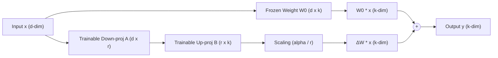
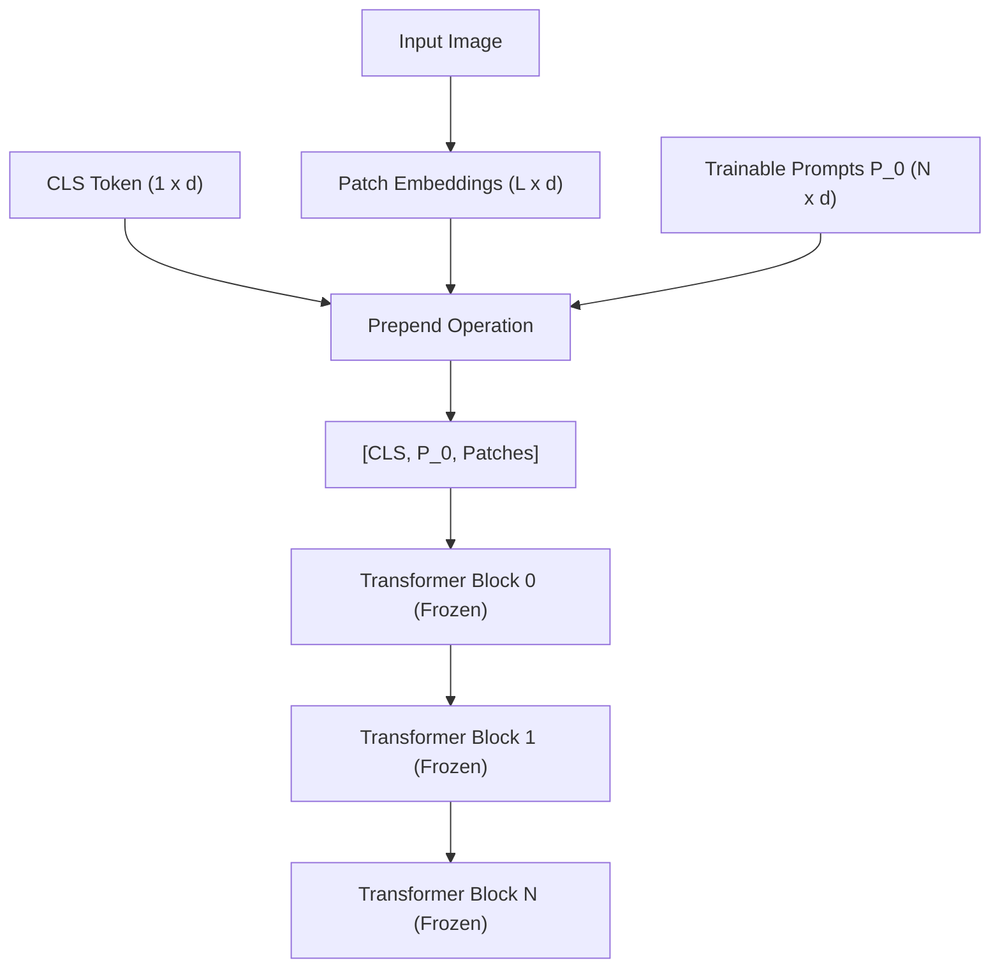
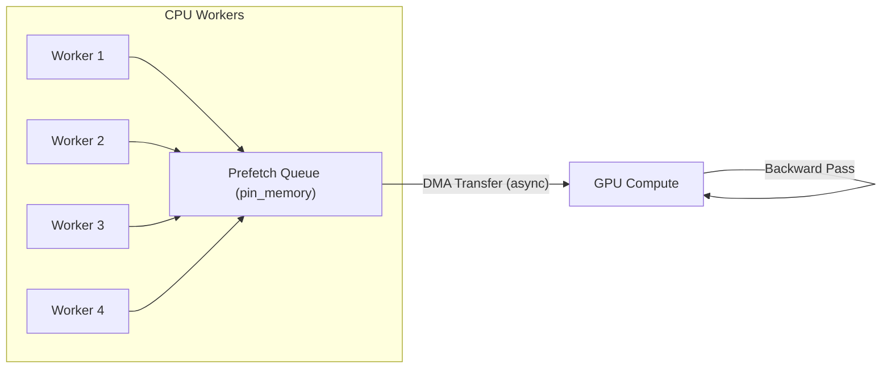
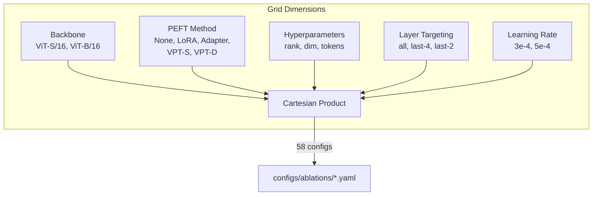

# 🔋 Battery Cell Anomaly Detection: PyTorch & PEFT Technical Implementation Reference

This document provides a detailed technical walkthrough of the codebase, explaining the PyTorch and Hugging Face integration design, class/method-level functionality, and the mathematical and architectural details of the Parameter-Efficient Fine-Tuning (PEFT) methods.

---

## 🏛️ 1. High-Level Architecture Overview

The system is designed for binary classification (normal vs. abnormal battery cells) under severe class imbalance. The architecture uses a frozen foundation model (such as DINOv3 or standard ViT) as a feature extractor, with a configurable Multi-Layer Perceptron (MLP) classification head. 

To adapt the backbone to the anomaly detection task efficiently, we support four PEFT methods. The core design decision is to **wrap only the backbone** (`self.backbone`) using PEFT wrappers, leaving the final classifier head (`self.classifier`) as standard trainable PyTorch parameters.

```
                  ┌──────────────────────────────────────────────┐
                  │                Input Image                   │
                  └──────────────────────┬───────────────────────┘
                                         ▼
                  ┌──────────────────────────────────────────────┐
                  │        AutoImageProcessor / Transform        │
                  └──────────────────────┬───────────────────────┘
                                         ▼
   ┌────────────────────────────────────────────────────────────────────────────┐
   │                          Frozen DINOv3 Backbone                            │
   │  (Optional PEFT: LoRA / Pfeiffer Bottleneck / VPT Shallow / VPT Deep)      │
   └─────────────────────────────────────┬──────────────────────────────────────┘
                                         ▼
                  ┌──────────────────────────────────────────────┐
                  │    CLS Token Features (last_hidden_state[0]) │
                  └──────────────────────┬───────────────────────┘
                                         ▼
                  ┌──────────────────────────────────────────────┐
                  │         Trainable Classification Head        │
                  └──────────────────────┬───────────────────────┘
                                         ▼
                  ┌──────────────────────────────────────────────┐
                  │                 Binary Logits                │
                  └──────────────────────────────────────────────┘
```

---

## 🔍 2. Code Walkthrough & Class Details

### 🛠️ 2.1. Model Module (`src/bcadfm/models/dinov3_classifier.py`)

This file contains the backbone wrapping logic, bottleneck adapter blocks, VPT layers, and the final classification head construction.

#### `HeadConfig` (Dataclass)
Defines the classification head configuration:
- `num_labels` (int): Output dim (default: 2).
- `depth` (int): Number of linear layers.
- `hidden_dim` (int, float, or str, optional): Size of intermediate layers when `depth > 1`. Can be an absolute number of neurons (`int`), a multiplier (`float` like `0.5`), or a multiplier string with 'X' suffix (`str` like `"1.1X"`).
- `dropout` (float): Dropout probability between linear layers.

#### `BottleneckAdapter` (nn.Module)
Pfeiffer-style bottleneck adapter module inserted after FFN/MLP blocks.
- **Sub-methods**:
  - `__init__(self, input_dim, bottleneck_dim, dropout)`: Initializes the down-projection layer ($W_{down} \in \mathbb{R}^{d \times r}$), GELU activation, up-projection layer ($W_{up} \in \mathbb{R}^{r \times d}$), and dropout.
  - **Initialization details**: The down-projection weights are initialized with Kaiming uniform. Crucially, the up-projection weights and bias are initialized to **zeros**. This guarantees that at step 0, the adapter acts as an identity mapping ($\Delta x = 0$), preventing any initial degradation of backbone features.
  - `forward(self, x)`: Computes $y = x + \text{UpProj}(\text{GELU}(\text{DownProj}(x)))$ via residual connection.

#### `AdapterWrappedMLP` (nn.Module)
Wraps the original MLP block of a transformer block with a `BottleneckAdapter`.
- **Sub-methods**:
  - `__init__(self, original_mlp, bottleneck_dim, dropout)`: Wraps `original_mlp` and dynamically infers the hidden embedding dimension of the transformer block by inspecting attributes like `fc2` or `dense` of the FFN, falling back to scanning linear modules. It then instantiates the `BottleneckAdapter`.
  - `forward(self, x)`: Passes input `x` through the original MLP, then through the bottleneck adapter.

#### `apply_adapters` (Helper Function)
Recursively locates the MLP blocks of a transformer backbone and replaces them with `AdapterWrappedMLP`.
- **Logic**: Traverses the model hierarchy looking for common block names (`encoder.layer`, `model.layer`, etc.), freezes all backbone weights, wraps the target block layers (specifically `layer.mlp`), and sets `requires_grad = True` exclusively on the adapter parameters.

#### `VptLayerWrapper` (nn.Module)
Used in **Deep VPT** to inject learnable prompt tokens at intermediate transformer blocks.
- **Sub-methods**:
  - `forward(self, hidden_states, *args, **kwargs)`: Receives `hidden_states` of shape `(batch, seq_len, hidden_dim)`. Because the previous layer output contains the prompts of *that* layer, it extracts the CLS token `hidden_states[:, :1, :]` and patch tokens `hidden_states[:, 1 + num_tokens:, :]`, discarding the old prompts. It then prepends the new block-specific prompt parameter `self.prompt` (expanded to batch size) and forwards the combined tensor through `self.original_layer`.

#### `VptWrappedBackbone` (nn.Module)
Wraps the Hugging Face transformer model to manage Shallow and Deep Visual Prompt Tuning.
- **Sub-methods**:
  - `__init__(self, original_backbone, num_tokens, deep, target_blocks)`: Freezes the backbone parameters, registers the shallow prompt parameter `self.prompt` of shape `(1, num_tokens, hidden_size)` with Xavier uniform initialization. If `deep=True`, it instantiates an `nn.ParameterDict` containing learnable prompts for intermediate layers, wrapping those layers with `VptLayerWrapper`.
  - `forward(self, pixel_values, ...)`: Fetches patch embeddings from the backbone's embedding layer, prepends the shallow prompt, and routes the combined sequence to the backbone's encoder module.

#### `DinoV3Classifier` (nn.Module)
The core model class combining the wrapped backbone and classification head.
- **Sub-methods**:
  - `__init__(self, model_name_or_path, head_config, peft_config, freeze_backbone, id2label, label2id)`: Loads the backbone, freezes parameters, wraps the backbone with `LoraConfig` (if `peft_type == "lora"`), `apply_adapters` (if `peft_type == "adapter"`), or `VptWrappedBackbone` (if `peft_type == "visual_prompt"`). Then calls `_build_head` to instantiate the MLP head.
  - `_build_head(input_dim, cfg)`: Instantiates a sequence of `nn.Linear`, `nn.GELU`, and `nn.Dropout` based on `HeadConfig`.
  - `forward(self, pixel_values, labels)`: Extracts backbone representation, grabs the `CLS` token output at index `0` of the sequence (or pooler output), passes it to the MLP head, and computes cross-entropy if `labels` are provided.

---

### 🏃 2.2. Trainer Module (`src/bcadfm/training/trainer.py`)

Implements the custom training loop subclassing Hugging Face's `Trainer`.

#### `ImbalanceTrainer`
- **Sub-methods**:
  - `__init__(self, *args, imbalance_config, **kwargs)`: Captures `imbalance_config` and triggers imbalance setup.
  - `_prepare_imbalance_handling(self)`: Counts training class frequencies, computes loss scaling weights (if `class_weights` is enabled), and instantiates `self.loss_fn`.
  - `_get_train_labels(self)`: Utility to extract ground-truth labels from the training dataset by inspecting samples directly or scanning items.
  - `_init_loss_fn(self)`: Sets up loss functions. Returns `FocalLoss` with computed class weights/hyperparameters, or `nn.CrossEntropyLoss` with inverse class-weight tensors.
  - `_get_train_sampler(self, *args, **kwargs)`: Overrides Hugging Face's sampler creation. If `oversampling_method == "weighted_sampler"`, computes balanced sample weights and returns PyTorch's `WeightedRandomSampler`. Checks DDP status and issues warnings if used under multi-GPU setups.
  - `compute_loss(self, model, inputs, return_outputs, num_items_in_batch)`: Computes loss using the model's logits and `self.loss_fn`.

---

### 📉 2.3. Loss Module (`src/bcadfm/training/losses.py`)

Implements custom loss functions.

#### `FocalLoss` (nn.Module)
Focuses training on hard-to-classify samples.
- **Math**:
  $$FL(p_t) = -\alpha_t (1 - p_t)^\gamma \log(p_t)$$
- **Sub-methods**:
  - `forward(self, logits, targets)`: Computes sample-wise cross-entropy with `reduction="none"`. Computes probability $p_t = \exp(-\text{ce\_loss})$. Multiplies by focal scaling term $((1 - p_t)^\gamma)$. If class balancing factor `self.alpha` is supplied, gathers the corresponding $\alpha_t$ based on target class indices and scales the loss before calculating the final reduction.

#### `compute_class_weights`
Computes class balancing weights. Supports:
- `"balanced"`: $\text{weight}_c = \frac{N}{C \times n_c}$
- `"inverse"`: $\text{weight}_c = \frac{1}{n_c}$ (normalized)

---

### 💾 2.4. Data Module (`src/bcadfm/data/dataset.py`)

Handles PIL image loading, data partitioning, augmentations, and data-level oversampling.

#### `BatteryCellDataset` (Dataset)
- **Sub-methods**:
  - `_collect_samples(self)`: Scans class directories and stores paths to image files as `ImageSample` instances.
  - `oversample_dataset(self)`: Balances dataset in-place. Finds the majority class count, duplicates minority class samples randomly using `random.choices` to match that count, and shuffles. This is **DDP-safe** because the expanded dataset is partitioned cleanly by the `DistributedSampler`.
  - `__getitem__(self, idx)`: Opens an image, applies augmentations, runs it through Hugging Face's `AutoImageProcessor` to normalise, crop, and resize, returning a dict with `"pixel_values"` and `"labels"`.

#### `build_augmentation_pipeline`
Constructs custom training transforms. Builds `RandomAugmentationCombo` which implements:
1. Global selection: decide to augment based on `aug_global_prob`.
2. Limit count: sample up to `aug_max_transforms` unique operations.
3. Order-stable sequential application.

### ⚙️ 2.5. Scheduler & Hyperparameter Config (`src/bcadfm/utils/config.py`)

Handles configuration parsing and routing for learning rate schedulers and warmup:
- **`SchedulerConfig`**: Contains `lr_scheduler_type` (e.g. `"cosine"`, `"linear"`) and `warmup_ratio` (percentage of total steps for linear warmup, e.g. `0.1`).
- **Warmup and Decay Integration**: The `warmup_ratio` is routed directly to the Hugging Face `TrainingArguments` in `scripts/train.py`. The trainer dynamically calculates the exact number of warmup steps based on epochs, batch size, and GPU count, applying a linear warmup followed by the selected decay schedule (such as cosine decay).

---

## 📐 3. PEFT Methods: Theory & Architecture

### ⚡ 3.1. LoRA (Low-Rank Adaptation)

#### Theoretical Overview
LoRA parameterizes the weight update matrix $\Delta W$ of a linear layer using a low-rank decomposition. For a frozen weight matrix $W_0 \in \mathbb{R}^{d \times k}$, the weight update is written as:
$$W = W_0 + \Delta W = W_0 + \frac{\alpha}{r} (B \cdot A)$$
where:
- $B \in \mathbb{R}^{d \times r}$ and $A \in \mathbb{R}^{r \times k}$ are trainable parameters.
- $r \ll \min(d, k)$ is the bottleneck rank (e.g. $r=8$).
- $\alpha$ is a scaling hyperparameter.

The input $x$ is multiplied by both the frozen and low-rank paths in parallel:
$$h = W_0 x + \frac{\alpha}{r} B A x$$

#### Architecture Diagram


---

### 🪢 3.2. Pfeiffer Bottleneck Adapters

#### Theoretical Overview
Adapters insert small bottleneck sub-networks after specific projection layers. The Pfeiffer adapter configuration places the bottleneck module after the Multi-Layer Network (MLP/FFN) block.
The input to the adapter $h$ (the output of the FFN) is projected down to a low-dimensional bottleneck space, passed through a non-linearity, and projected back up to the transformer embedding dimension:
$$h' = h + f(h W_{down}) W_{up}$$
where:
- $W_{down} \in \mathbb{R}^{d \times r}$ projects the dimension down.
- $f(\cdot)$ is the GELU non-linear activation.
- $W_{up} \in \mathbb{R}^{r \times d}$ projects the dimension back up.
- A residual connection adds the original input $h$ back to the bottleneck output.

#### Architecture Diagram
```mermaid
graph TD
    x["Input x (d-dim)"] --> MLP["Original MLP / FFN Block (Frozen)"]
    MLP --> adapter_in["MLP Output (d-dim)"]
    
    subgraph Bottleneck Adapter (Trainable)
        adapter_in --> Down["Down Projection (d -> r)"]
        Down --> Act["GELU Activation"]
        Act --> Drop["Dropout"]
        Drop --> Up["Up Projection (r -> d)"]
    end
    
    adapter_in --> Res((+))
    Up --> Res
    Res --> Out["Output y (d-dim)"]
```

---

### 👁️ 3.3. Visual Prompt Tuning (VPT)

#### Theoretical Overview
VPT prepends trainable continuous prompt parameters to the input sequence of transformer blocks, keeping the transformer parameters frozen.

##### Shallow VPT
Trainable prompt parameters $P_0 \in \mathbb{R}^{N \times d}$ are prepended only to the input patch embeddings at the first transformer layer:
$$X_0 = [\text{CLS}, P_0, E]$$
where $E \in \mathbb{R}^{L \times d}$ is the sequence of patch tokens. For all subsequent layers $i > 0$, no new prompts are introduced; the prompts simply propagate through the frozen blocks:
$$X_i = \text{Layer}_i(X_{i-1})$$

##### Deep VPT
Trainable prompt parameters $P_i \in \mathbb{R}^{N \times d}$ are prepended at the input of *every* layer. The prompts output by layer $i-1$ are discarded, and new, layer-specific learnable prompts $P_i$ are inserted before entering layer $i$:
$$X_i = \text{Layer}_i([\text{CLS}_{i-1}, P_i, \text{Patches}_{i-1}])$$

#### Shallow VPT Diagram


#### Deep VPT Diagram
```mermaid
graph TD
    subgraph Layer 0 Input
        cls0["CLS Token (1 x d)"] --> Prep0["Prepend"]
        embed["Patch Embeddings"] --> Prep0
        prompt0["Trainable Prompts P_0"] --> Prep0
        Prep0 --> seq0["[CLS, P_0, Patches]"]
    end
    
    seq0 --> Block0["Transformer Block 0 (Frozen)"]
    
    subgraph Layer 1 Input (VptLayerWrapper)
        Block0 --> split0["Split Output"]
        split0 --> cls_out0["CLS Token"]
        split0 --> discard0["Discard P_0 Prompts"]
        split0 --> patches_out0["Patch Tokens"]
        
        cls_out0 --> Prep1["Prepend"]
        prompt1["New Trainable Prompts P_1"] --> Prep1
        patches_out0 --> Prep1
        Prep1 --> seq1["[CLS, P_1, Patches]"]
    end
    
    seq1 --> Block1["Transformer Block 1 (Frozen)"]
```

---

## 🔬 4. GPU VRAM & DDP Isolation Verification Utilities

To verify independent access to the 8 GPUs on the NVIDIA A16 system, two lightweight validation scripts are provided in the `scripts/` directory:

### 4.1. Single-GPU VRAM Allocator (`scripts/gpu_alloc_test.py`)
This script isolates the target GPUs using `CUDA_VISIBLE_DEVICES` and performs a clean 4.0 GB memory allocation:
- **Allocation logic**: Allocates a tensor of shape `(1024, 1024, 1024)` of `torch.float32` (exactly 4,294,967,296 bytes) on `cuda:0` of the isolated environment.
- **VRAM Verification**: Sleeps for a user-specified duration (`--duration`) keeping the tensor in memory so you can run `nvidia-smi` to inspect process placement.

### 4.2. Dummy DDP Process Group Allocator (`scripts/ddp_alloc_test.py`)
This script initializes the PyTorch distributed process group using the NCCL backend and allocates 4.0 GB on each participating GPU:
- **NCCL initialization**: Triggers `dist.init_process_group(backend="nccl")`.
- **Rank routing**: Resolves local GPU placement using the `LOCAL_RANK` environment variable, selects the device via `torch.cuda.set_device`, and allocates the 4.0 GB tensor.
- **Port Conflict Prevention**: To run multiple independent DDP training/validation loops simultaneously, you must override the default master port (`29500`) using the `--master_port` flag:
  ```bash
  CUDA_VISIBLE_DEVICES=3,4 torchrun --nproc_per_node=2 --master_port=29501 scripts/ddp_alloc_test.py
  CUDA_VISIBLE_DEVICES=5,6 torchrun --nproc_per_node=2 --master_port=29502 scripts/ddp_alloc_test.py
  ```

---

## 🔄 5. Performance Optimizations

Several performance optimizations were implemented across the data pipeline, augmentation logic, checkpoint management, and training configuration to reduce training wall-clock time and eliminate unnecessary GPU/CPU overhead.

### ⚡ 5.1. Data Loading Pipeline

The data loading pipeline in `scripts/train.py` is configured via `TrainingArguments` with the following optimizations:

- **`dataloader_num_workers=4`**: Spawns 4 parallel worker processes for data loading. These workers prefetch and preprocess the next batches while the GPU is executing the forward/backward pass, overlapping I/O latency with computation.
- **`pin_memory=True`**: Allocates host (CPU) tensors in page-locked (pinned) memory. This enables asynchronous DMA (Direct Memory Access) transfers from CPU→GPU via `cudaMemcpyAsync`, bypassing the pageable memory staging buffer and reducing data transfer latency.



### 🔧 5.2. Augmentation Pipeline

Optimizations in `src/bcadfm/data/dataset.py` within `build_augmentation_pipeline()` and the dataset's `__getitem__`:

- **Pre-built reusable transform objects**: Previously, transform objects (e.g., `ColorJitter`, `RandomRotation`, `RandomCrop`) were instantiated on every call to `__getitem__`. The optimized version instantiates all transform objects once in `build_augmentation_pipeline()` and reuses them across all dataset access calls.
- **NumPy-based Gaussian noise**: The Gaussian noise augmentation was reimplemented to operate directly on float arrays using `np.random.normal`, eliminating the expensive round-trip conversion chain:

  $$\text{PIL Image} \xrightarrow{\text{ToTensor}} \text{Tensor} \xrightarrow{\text{add noise}} \text{Tensor} \xrightarrow{\text{ToPIL}} \text{PIL Image}$$

  The optimized path:

  $$\text{np.array (float32)} \xrightarrow{\text{np.random.normal}} \text{np.array (float32)} \xrightarrow{\text{clip}} \text{np.array (uint8)}$$

- **Single-instantiation transforms**: Color jitter, rotation, flip, and crop transforms are instantiated once and reused across all `__getitem__` calls, avoiding repeated object allocation overhead.

### 💾 5.3. Checkpoint Saving Optimization

In `src/bcadfm/metrics/cls_callbacks.py`, the `SaveTwoBestClsModelsCallback` was optimized to eliminate redundant memory operations:

- **Before**: `model.state_dict()` was called on **every evaluation step**, creating a full RAM copy of model weights regardless of whether the current metrics improved.
- **After**: `model.state_dict()` is called **only when a new best metric** (loss or F1) is actually achieved.

This avoids redundant deep copies of the entire model parameter tensor set on non-improving evaluation steps, which is especially significant for large backbones:

$$\text{Memory saved per non-improving eval} = |\theta_{\text{model}}| \times \text{sizeof(float32)}$$

For a ViT-B/16 backbone ($|\theta| \approx 85.7\text{M}$ params), this saves $\approx 343\text{ MB}$ of RAM allocation per skipped checkpoint.

### 🔩 5.4. Training Configuration Fixes

Several configuration issues in `TrainingArguments` were resolved:

| Issue | Resolution |
|---|---|
| `warmup_ratio` deprecation warning | Replaced with `warmup_steps` computed directly |
| Implicit eval/save strategy | Set `eval_strategy='epoch'` and `save_strategy='epoch'` explicitly |
| Redundant `model.to(device)` | Removed manual device placement calls that conflicted with `Trainer`'s internal device management |

---

## 🧪 6. Ablation Study Framework

A complete ablation study infrastructure was built to systematically evaluate the impact of backbone size, PEFT method, hyperparameters, and layer targeting on classification performance.

### 📋 6.1. Configuration Generation (`scripts/generate_ablation_grid.py`)

Generates a combinatorial grid of **58 YAML configurations** under `configs/ablations/`.

#### Grid Dimensions

| Dimension | Values |
|---|---|
| **Backbone** | ViT-S/16 ($21.6\text{M}$ params), ViT-B/16 ($85.7\text{M}$ params) |
| **PEFT Method** | None (frozen), LoRA, Bottleneck Adapters, VPT Shallow, VPT Deep |
| **LoRA Rank** | $r \in \{8, 16\}$ |
| **Adapter Bottleneck Dim** | $d_{\text{bottleneck}} \in \{32, 64\}$ |
| **VPT Prompt Tokens** | $N \in \{8, 16, 32\}$ |
| **Layer Targeting** | all, last-4, last-2 transformer blocks |
| **Learning Rate** | $\eta \in \{3 \times 10^{-4},\ 5 \times 10^{-4}\}$ |

#### Base Configuration (Inherited by All Configs)

All ablation configs inherit the following shared settings:
- **Epochs**: 300
- **Batch size**: 64
- **LR schedule**: Cosine decay with linear warmup
- **Loss function**: Focal loss
- **Class balancing**: Dataset-level oversampling

#### Naming Convention

```
{index}_{peft}_{backbone}_{hyperparams}.yaml
```

Example: `007_lora_vit-b16_r16_last4_lr3e-4.yaml`



### ✅ 6.2. Configuration Validation (`scripts/validate_ablation_configs.py`)

Loads each generated YAML config, instantiates the model and image processor, and performs validation checks:

1. **Model loading**: Verifies the backbone loads from Hugging Face without errors.
2. **PEFT wrapper application**: Confirms the correct PEFT method is applied (LoRA modules injected, adapters wrapped, VPT prompts registered).
3. **Parameter count verification**: Checks that trainable parameter percentages match expectations for the given PEFT method and hyperparameters.

Outputs a **PASS/FAIL report** with per-config parameter summaries:

```
[PASS] 007_lora_vit-b16_r16_last4_lr3e-4.yaml
       Total: 85.7M | Trainable: 0.29M (0.34%) | PEFT: LoRA r=16
[FAIL] 042_adapter_vit-s16_d32_all_lr5e-4.yaml
       Error: Adapter dim 32 exceeds hidden_dim for ViT-S/16 block
```

### 🚀 6.3. Parallel Training Runner (`scripts/run_parallel_ablations.py`)

Distributes training jobs across **8 GPUs** using a shared queue architecture.

#### Execution Architecture

```mermaid
graph TD
    subgraph Main Thread
        Q["Job Queue<br/>(58 configs)"] --> Assign["GPU Slot Assignment"]
        Assign --> |"CUDA_VISIBLE_DEVICES=i"| Sub0["subprocess.Popen<br/>GPU 0"]
        Assign --> |"CUDA_VISIBLE_DEVICES=i"| Sub1["subprocess.Popen<br/>GPU 1"]
        Assign --> |"..."| SubN["..."]
        Assign --> |"CUDA_VISIBLE_DEVICES=i"| Sub7["subprocess.Popen<br/>GPU 7"]
    end

    subgraph Reader Threads (8x)
        Sub0 --> R0["Thread 0<br/>stdout regex parser"]
        Sub1 --> R1["Thread 1<br/>stdout regex parser"]
        Sub7 --> R7["Thread 7<br/>stdout regex parser"]
    end

    subgraph Shared State
        R0 --> Slots["_slots dict<br/>(threading.Lock)"]
        R1 --> Slots
        R7 --> Slots
        Slots --> Dash["ANSI Dashboard<br/>(8-line in-place)"]
    end
```

#### Key Design Details

| Component | Implementation |
|---|---|
| **GPU isolation** | Each subprocess launched with `CUDA_VISIBLE_DEVICES` environment variable |
| **Concurrency** | One config per GPU at a time; 8 jobs run in parallel |
| **Progress parsing** | 8 reader threads parse subprocess stdout via regex for epoch, loss, and F1 |
| **Thread safety** | Shared `_slots` dictionary guarded by `threading.Lock` |
| **Terminal dashboard** | ANSI escape codes for fixed 8-line in-place display |
| **Logging** | Full logs per config written to `outputs/logs/<config_name>.log` |
| **Resume support** | Skips configs with existing completed output directories |
| **Graceful shutdown** | `Ctrl+C` handler terminates all subprocesses cleanly |

#### Output Directory Collision Resolution

When executing multiple parallel ablation runs concurrently, a race condition occurred where concurrent runs generated identical seconds-level timestamps. This caused directory name clashes, resulting in file access conflicts and `SafetensorError: I/O error` failures when attempting to save or load checkpoints.

To resolve this, output directories are now isolated by appending the original configuration file's stem (`__cfg_stem`) before the timestamp:
`outputs/cls__<safe_model_name>__<cfg_stem>/<timestamp>`

#### Dashboard Display

Each of the 8 lines displays:

```
[GPU 3] 007_lora_vit-b16_r16 | Epoch 42/300 |████████░░| loss: 0.234 | F1: 0.891 | training
```

Fields: GPU ID, config name, epoch progress, tqdm-style bar, current loss, current F1 score, status (`loading` / `training` / `done` / `failed`).

---

## 📊 7. DINOv3 Architecture Notes

During development, several DINOv3-specific architectural differences from standard ViT models were discovered and handled in the codebase.

### 🏗️ 7.1. Attention Projection Naming

DINOv3 uses a non-standard naming convention for its attention projection layers:

| Standard ViT | DINOv3 |
|---|---|
| `query` | `q_proj` |
| `key` | `k_proj` |
| `value` | `v_proj` |
| `output.dense` | `o_proj` |

### 🔗 7.2. Layer Hierarchy

The transformer block hierarchy differs from standard Hugging Face ViT implementations:

```
# Standard ViT (HuggingFace)
model.encoder.layer.{i}.attention.attention.query

# DINOv3
model.layer.{i}.attention.q_proj
```

Note the absence of the `encoder` prefix and the flattened `attention` → `{proj_name}` structure (no nested `attention.attention`).

### 🎯 7.3. LoRA Target Modules

For LoRA injection, the standard target modules are:
- `q_proj` (query projection)
- `v_proj` (value projection)

These are passed to `peft.LoraConfig(target_modules=["q_proj", "v_proj"])`.

### 🔍 7.4. Dynamic Layer Resolution

Because different model architectures expose transformer blocks under different attribute paths, the codebase dynamically resolves the layer structure by inspecting multiple candidate attributes in order:

```python
# Resolution priority in apply_adapters() and VptWrappedBackbone
for attr in ["encoder.layer", "model.layer", "layer", "layers"]:
    blocks = resolve_nested_attr(backbone, attr)
    if blocks is not None:
        break
```

This ensures compatibility across standard ViT (`encoder.layer`), DINOv3 (`model.layer`), and other potential backbone architectures.

### 🔄 7.5. Visual Prompt Tuning (VPT) Fallback Execution

The DINOv3 `AutoModel` lacks an `encoder` attribute because its transformer blocks are located directly under the `layer` attribute. To support Deep and Shallow Visual Prompt Tuning (VPT) without altering the pre-trained model structure, a sequential fallback execution logic is implemented in `VptWrappedBackbone.forward`:

- **Manual Iteration**: The forward pass manually loops through the resolved `self.layers` block-by-block.
- **Propagation**: Hidden states and relevant metadata (such as `head_mask`) are manually passed to each transformer block.
- **Aggregation**: It systematically collects and aggregates intermediate hidden states and self-attentions across all layers.
- **API Matching**: The final output is wrapped in a standard Hugging Face `BaseModelOutput` container, ensuring the downstream classification head receives the structure it expects (e.g. `last_hidden_state`).

---

## 📊 8. Results Visualization & Analysis Suite

To make the results of the DINOv3 + PEFT ablation study highly interpretable and interactive, we implement two primary analysis interfaces: a local Jupyter notebook and a Streamlit dashboard.

### 📓 8.1. Interactive Jupyter Notebook (`notebooks/visualize_results.ipynb`)

Designed for direct local analysis in the development environment, the notebook integrates:
- **Recursive scanner**: Walks the `outputs/` folder structure, matching runs against original configurations in `configs/ablations/`.
- **Fail-safe trainer state fallback**: Searches for the highest-indexed `checkpoint-*/trainer_state.json` inside a run folder if a top-level `trainer_state.json` does not exist (enabling real-time tracking of active or interrupted runs).
- **Widgets Filtering**: Uses `ipywidgets` to dynamically filter the leaderboard by task, backbone size, PEFT method, learning rate, and class imbalance strategy.
- **Line Comparators**: Uses Plotly to render curves for train loss, validation loss, validation accuracy, precision, recall, and F1 across multiple selected runs.

### 🖥️ 8.2. Streamlit Web Dashboard (`visualize.py`)

A full-featured Streamlit application serving as a central hub for training diagnostics.

#### Dynamic Filters & Sidebar
- Users can filter by Backbone Model, PEFT type, Learning Rate, and Imbalance Strategy.
- **Future-proofing placeholders**: In accordance with system specifications, filters include placeholder entries for planned tasks (e.g. `Segmentation (Future)`, `Object Detection (Future)`) and upcoming hyperparameters (e.g. `SGD` or `ScheduleFree` optimizers, custom weight decay ranges). Selecting these display future performance predictions and design tables.

#### Diagnostic Tabs
1. **🏆 Leaderboard**: Generates a tabular view of all runs sorted descending by **Validation F1 Score**. Max F1 cells are highlighted.
2. **📈 Trajectory Curves**: Plots multiple runs together. Enables optional curve truncation at the best epoch (to inspect metrics at the early-stopping boundary).
3. **🔬 Single Run Inspector**:
   - Inspects a single run's metadata and hyperparameter dictionaries.
   - Computes and renders a **Validation Confusion Matrix** (TP, TN, FP, FN) for the best epoch using a Plotly heatmap.
4. **📊 PEFT & Hyperparameter Analysis**:
   - Aggregates best F1 scores across PEFT methods and learning rates.
   - Displays a **Parallel Coordinates Plot** correlating learning rate, PEFT parameter size (LoRA rank, adapter bottleneck dimensions, VPT token counts), and final F1 score.

---

## 🎯 9. YOLO26 + DINOv3 SFP Object Detection Integration

To extend our foundation model pipeline from classification to object detection, we integrated the frozen DINOv3 vision backbone with a Simple Feature Pyramid (SFP) neck and the standard Ultralytics YOLO26 detection head.

### 📐 9.1. Simple Feature Pyramid (SFP) Neck
Vision Transformers process images at a single scale (typically producing patches at stride 16). Object detection networks, however, require multi-scale representations to handle objects of varying sizes. The SFP neck projects the single-scale DINOv3 output into a multi-scale representation corresponding to strides 8 (P3), 16 (P4), and 32 (P5):

- **`DinoV3SFP_P3` (Stride 8)**: Upsamples features by a factor of 2:
  $$h_{P3} = \text{Smooth}(\text{Project}(\text{ConvTranspose2d}(h_{stride16}, \text{stride}=2)))$$
- **`DinoV3SFP_P4` (Stride 16)**: Direct mapping of features:
  $$h_{P4} = \text{Smooth}(\text{Project}(h_{stride16}))$$
- **`DinoV3SFP_P5` (Stride 32)**: Downsamples features by a factor of 2:
  $$h_{P5} = \text{Smooth}(\text{Project}(\text{MaxPool2d}(h_{stride16}, \text{stride}=2)))$$

```
                               ┌─────────────────────────┐
                               │ DINOv3 Backbone (Flat)  │
                               │  Sequence of Patches    │
                               └───────────┬─────────────┘
                                           ▼
                               ┌─────────────────────────┐
                               │ 2D Grid (B, D, H/16, W) │
                               └─────┬───┬─────────┬─────┘
                  ┌──────────────────┘   │         └──────────────────┐
                  ▼                      ▼                            ▼
        ┌──────────────────┐   ┌──────────────────┐         ┌──────────────────┐
        │ DinoV3SFP_P3     │   │ DinoV3SFP_P4     │         │ DinoV3SFP_P5     │
        │ ConvTranspose2d  │   │   Conv2d (1x1)   │         │    MaxPool2d     │
        └─────────┬────────┘   └─────────┬────────┘         └─────────┬────────┘
                  ▼                      ▼                            ▼
        ┌──────────────────┐   ┌──────────────────┐         ┌──────────────────┐
        │ Stride 8 (P3)    │   │ Stride 16 (P4)   │         │ Stride 32 (P5)   │
        └─────────┬────────┘   └─────────┬────────┘         └─────────┬────────┘
                  │                      │                            │
                  └──────────────────────┼────────────────────────────┘
                                         ▼
                               ┌──────────────────┐
                               │  YOLO26 Head     │
                               └──────────────────┘
```

### 🔌 9.2. Dynamic Ultralytics Registration Hook
To inject custom classes (`DinoV3Backbone`, `DinoV3SFP_P3`, `DinoV3SFP_P4`, `DinoV3SFP_P5`) into the Ultralytics tasks parser dynamically without modifying vendor code, we implement a monkey-patching helper:

1. **Globals Injection**: `setattr(ultralytics.nn.tasks, module_name, module_class)` binds the custom modules to the parsing module's namespace.
2. **`sys.modules` Binding**: Registers the custom layers in `sys.modules["ultralytics.nn.tasks"]` to ensure compatibility with pickle serialization during checkpoint loading.
3. **`parse_model` Interceptor**:
   - The Ultralytics parser executes width and depth scaling on layers listed in the architecture YAML config. Because custom layers are not present in standard `base_modules`, the native parser cannot calculate scaled channel dimensions correctly.
   - We intercept `parse_model` with a wrapper `custom_parse_model`. It temporary translates custom layer classes into standard `Conv` layers, runs the native parser to compute scaled dimensions (relying on standard YOLO logic), and then reconstructs the custom layers using the computed scaled channel sizes.
   - **Attribute Preservation**: The native parser attaches vital metadata properties (`i` module index, `f` input index, `type` name, `np` parameter count) to instantiated PyTorch modules. When swapping out the placeholder `Conv` layers for custom modules, we explicitly copy these metadata attributes to the constructed modules:
     ```python
     for attr in ("i", "f", "type", "np"):
         if hasattr(placeholder, attr):
             setattr(actual_layer, attr, getattr(placeholder, attr))
     ```

### 🖼️ 9.3. Device-Safe Computation Graph Normalization
To prevent preprocessing discrepancy between YOLO (scaling pixel values to $[0, 1]$) and DINOv3 (standardizing with ImageNet mean/std), image normalization is embedded directly inside the custom backbone module. The mean and standard deviation are registered as model buffers:
```python
self.register_buffer("mean", torch.tensor([0.485, 0.456, 0.406]).view(1, 3, 1, 1))
self.register_buffer("std", torch.tensor([0.229, 0.224, 0.225]).view(1, 3, 1, 1))
```
During the forward pass, standardization is executed on the GPU:
$$x_{norm} = \frac{x - \mu}{\sigma}$$
This guarantees device safety and avoids duplicating preprocessing overrides during training, ONNX export, or TensorRT deployment.

### 🎟️ 9.4. Register Token Slicing
DINOv3 standardizes on 4 learned register tokens to absorb high-norm outlier features. The token layout returned by the model is:
$$\text{Tokens} = [\text{CLS}] \mathbin{\Vert} [\text{Reg}_1, \dots, \text{Reg}_4] \mathbin{\Vert} [\text{Patch}_1, \dots, \text{Patch}_M]$$
To reshape the flat patch sequence back to a 2D grid, we slice the tokens sequence starting after the CLS and register tokens:
$$h_{patches} = \text{last\_hidden\_state}[:, 1 + N_{registers} : 1 + N_{registers} + N_{patches}, :]$$

### 🏃 9.5. Dynamic Position Embedding Interpolation
During initialization, the Ultralytics parser calculates model strides by executing a forward pass using a $256 \times 256$ dummy tensor. Because pre-trained ViT architectures expect a fixed input resolution (e.g. $224 \times 224$), this raises shape validation exceptions. To support dynamic image sizes, we call the Hugging Face model forward pass with `interpolate_pos_encoding=True`:
```python
outputs = self.model(x_norm, interpolate_pos_encoding=True)
```
This enables the backbone to interpolate positional embeddings dynamically, allowing the integrated YOLO detector to handle input tensors of any size (e.g., standard $640 \times 640$).


