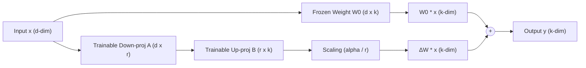
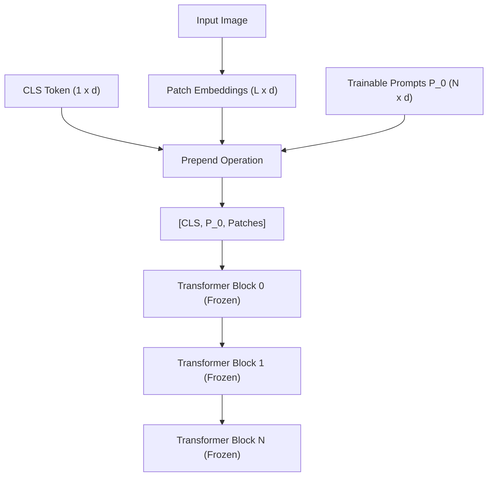

# 🔋 Battery Cell Anomaly Detection: PyTorch & PEFT Technical Implementation Reference

This document provides a detailed technical walkthrough of the codebase, explaining the PyTorch and Hugging Face integration design, class/method-level functionality, and the mathematical and architectural details of the Parameter-Efficient Fine-Tuning (PEFT) methods.

---

## 🏛️ 1. High-Level Architecture Overview

The system is designed for binary classification (normal vs. abnormal battery cells) under severe class imbalance. The architecture uses a frozen foundation model (such as DINOv3 or standard ViT) as a feature extractor, with a configurable Multi-Layer Perceptron (MLP) classification head. 

To adapt the backbone to the anomaly detection task efficiently, we support four PEFT methods. The core design decision is to **wrap only the backbone** (`self.backbone`) using PEFT wrappers, leaving the final classifier head (`self.classifier`) as standard trainable PyTorch parameters.

```
                  ┌──────────────────────────────────────────────┐
                  │                Input Image                   │
                  └──────────────────────┬───────────────────────┘
                                         ▼
                  ┌──────────────────────────────────────────────┐
                  │        AutoImageProcessor / Transform        │
                  └──────────────────────┬───────────────────────┘
                                         ▼
   ┌────────────────────────────────────────────────────────────────────────────┐
   │                          Frozen DINOv3 Backbone                            │
   │  (Optional PEFT: LoRA / Pfeiffer Bottleneck / VPT Shallow / VPT Deep)      │
   └─────────────────────────────────────┬──────────────────────────────────────┘
                                         ▼
                  ┌──────────────────────────────────────────────┐
                  │    CLS Token Features (last_hidden_state[0]) │
                  └──────────────────────┬───────────────────────┘
                                         ▼
                  ┌──────────────────────────────────────────────┐
                  │         Trainable Classification Head        │
                  └──────────────────────┬───────────────────────┘
                                         ▼
                  ┌──────────────────────────────────────────────┐
                  │                 Binary Logits                │
                  └──────────────────────────────────────────────┘
```

---

## 🔍 2. Code Walkthrough & Class Details

### 🛠️ 2.1. Model Module (`src/bcadfm/models/dinov3_classifier.py`)

This file contains the backbone wrapping logic, bottleneck adapter blocks, VPT layers, and the final classification head construction.

#### `HeadConfig` (Dataclass)
Defines the classification head configuration:
- `num_labels` (int): Output dim (default: 2).
- `depth` (int): Number of linear layers.
- `hidden_dim` (int, float, or str, optional): Size of intermediate layers when `depth > 1`. Can be an absolute number of neurons (`int`), a multiplier (`float` like `0.5`), or a multiplier string with 'X' suffix (`str` like `"1.1X"`).
- `dropout` (float): Dropout probability between linear layers.

#### `BottleneckAdapter` (nn.Module)
Pfeiffer-style bottleneck adapter module inserted after FFN/MLP blocks.
- **Sub-methods**:
  - `__init__(self, input_dim, bottleneck_dim, dropout)`: Initializes the down-projection layer ($W_{down} \in \mathbb{R}^{d \times r}$), GELU activation, up-projection layer ($W_{up} \in \mathbb{R}^{r \times d}$), and dropout.
  - **Initialization details**: The down-projection weights are initialized with Kaiming uniform. Crucially, the up-projection weights and bias are initialized to **zeros**. This guarantees that at step 0, the adapter acts as an identity mapping ($\Delta x = 0$), preventing any initial degradation of backbone features.
  - `forward(self, x)`: Computes $y = x + \text{UpProj}(\text{GELU}(\text{DownProj}(x)))$ via residual connection.

#### `AdapterWrappedMLP` (nn.Module)
Wraps the original MLP block of a transformer block with a `BottleneckAdapter`.
- **Sub-methods**:
  - `__init__(self, original_mlp, bottleneck_dim, dropout)`: Wraps `original_mlp` and dynamically infers the hidden embedding dimension of the transformer block by inspecting attributes like `fc2` or `dense` of the FFN, falling back to scanning linear modules. It then instantiates the `BottleneckAdapter`.
  - `forward(self, x)`: Passes input `x` through the original MLP, then through the bottleneck adapter.

#### `apply_adapters` (Helper Function)
Recursively locates the MLP blocks of a transformer backbone and replaces them with `AdapterWrappedMLP`.
- **Logic**: Traverses the model hierarchy looking for common block names (`encoder.layer`, `model.layer`, etc.), freezes all backbone weights, wraps the target block layers (specifically `layer.mlp`), and sets `requires_grad = True` exclusively on the adapter parameters.

#### `VptLayerWrapper` (nn.Module)
Used in **Deep VPT** to inject learnable prompt tokens at intermediate transformer blocks.
- **Sub-methods**:
  - `forward(self, hidden_states, *args, **kwargs)`: Receives `hidden_states` of shape `(batch, seq_len, hidden_dim)`. Because the previous layer output contains the prompts of *that* layer, it extracts the CLS token `hidden_states[:, :1, :]` and patch tokens `hidden_states[:, 1 + num_tokens:, :]`, discarding the old prompts. It then prepends the new block-specific prompt parameter `self.prompt` (expanded to batch size) and forwards the combined tensor through `self.original_layer`.

#### `VptWrappedBackbone` (nn.Module)
Wraps the Hugging Face transformer model to manage Shallow and Deep Visual Prompt Tuning.
- **Sub-methods**:
  - `__init__(self, original_backbone, num_tokens, deep, target_blocks)`: Freezes the backbone parameters, registers the shallow prompt parameter `self.prompt` of shape `(1, num_tokens, hidden_size)` with Xavier uniform initialization. If `deep=True`, it instantiates an `nn.ParameterDict` containing learnable prompts for intermediate layers, wrapping those layers with `VptLayerWrapper`.
  - `forward(self, pixel_values, ...)`: Fetches patch embeddings from the backbone's embedding layer, prepends the shallow prompt, and routes the combined sequence to the backbone's encoder module.

#### `DinoV3Classifier` (nn.Module)
The core model class combining the wrapped backbone and classification head.
- **Sub-methods**:
  - `__init__(self, model_name_or_path, head_config, peft_config, freeze_backbone, id2label, label2id)`: Loads the backbone, freezes parameters, wraps the backbone with `LoraConfig` (if `peft_type == "lora"`), `apply_adapters` (if `peft_type == "adapter"`), or `VptWrappedBackbone` (if `peft_type == "visual_prompt"`). Then calls `_build_head` to instantiate the MLP head.
  - `_build_head(input_dim, cfg)`: Instantiates a sequence of `nn.Linear`, `nn.GELU`, and `nn.Dropout` based on `HeadConfig`.
  - `forward(self, pixel_values, labels)`: Extracts backbone representation, grabs the `CLS` token output at index `0` of the sequence (or pooler output), passes it to the MLP head, and computes cross-entropy if `labels` are provided.

---

### 🏃 2.2. Trainer Module (`src/bcadfm/training/trainer.py`)

Implements the custom training loop subclassing Hugging Face's `Trainer`.

#### `ImbalanceTrainer`
- **Sub-methods**:
  - `__init__(self, *args, imbalance_config, **kwargs)`: Captures `imbalance_config` and triggers imbalance setup.
  - `_prepare_imbalance_handling(self)`: Counts training class frequencies, computes loss scaling weights (if `class_weights` is enabled), and instantiates `self.loss_fn`.
  - `_get_train_labels(self)`: Utility to extract ground-truth labels from the training dataset by inspecting samples directly or scanning items.
  - `_init_loss_fn(self)`: Sets up loss functions. Returns `FocalLoss` with computed class weights/hyperparameters, or `nn.CrossEntropyLoss` with inverse class-weight tensors.
  - `_get_train_sampler(self, *args, **kwargs)`: Overrides Hugging Face's sampler creation. If `oversampling_method == "weighted_sampler"`, computes balanced sample weights and returns PyTorch's `WeightedRandomSampler`. Checks DDP status and issues warnings if used under multi-GPU setups.
  - `compute_loss(self, model, inputs, return_outputs, num_items_in_batch)`: Computes loss using the model's logits and `self.loss_fn`.

---

### 📉 2.3. Loss Module (`src/bcadfm/training/losses.py`)

Implements custom loss functions.

#### `FocalLoss` (nn.Module)
Focuses training on hard-to-classify samples.
- **Math**:
  $$FL(p_t) = -\alpha_t (1 - p_t)^\gamma \log(p_t)$$
- **Sub-methods**:
  - `forward(self, logits, targets)`: Computes sample-wise cross-entropy with `reduction="none"`. Computes probability $p_t = \exp(-\text{ce\_loss})$. Multiplies by focal scaling term $((1 - p_t)^\gamma)$. If class balancing factor `self.alpha` is supplied, gathers the corresponding $\alpha_t$ based on target class indices and scales the loss before calculating the final reduction.

#### `compute_class_weights`
Computes class balancing weights. Supports:
- `"balanced"`: $\text{weight}_c = \frac{N}{C \times n_c}$
- `"inverse"`: $\text{weight}_c = \frac{1}{n_c}$ (normalized)

---

### 💾 2.4. Data Module (`src/bcadfm/data/dataset.py`)

Handles PIL image loading, data partitioning, augmentations, and data-level oversampling.

#### `BatteryCellDataset` (Dataset)
- **Sub-methods**:
  - `_collect_samples(self)`: Scans class directories and stores paths to image files as `ImageSample` instances.
  - `oversample_dataset(self)`: Balances dataset in-place. Finds the majority class count, duplicates minority class samples randomly using `random.choices` to match that count, and shuffles. This is **DDP-safe** because the expanded dataset is partitioned cleanly by the `DistributedSampler`.
  - `__getitem__(self, idx)`: Opens an image, applies augmentations, runs it through Hugging Face's `AutoImageProcessor` to normalise, crop, and resize, returning a dict with `"pixel_values"` and `"labels"`.

#### `build_augmentation_pipeline`
Constructs custom training transforms. Builds `RandomAugmentationCombo` which implements:
1. Global selection: decide to augment based on `aug_global_prob`.
2. Limit count: sample up to `aug_max_transforms` unique operations.
3. Order-stable sequential application.

### ⚙️ 2.5. Scheduler & Hyperparameter Config (`src/bcadfm/utils/config.py`)

Handles configuration parsing and routing for learning rate schedulers and warmup:
- **`SchedulerConfig`**: Contains `lr_scheduler_type` (e.g. `"cosine"`, `"linear"`) and `warmup_ratio` (percentage of total steps for linear warmup, e.g. `0.1`).
- **Warmup and Decay Integration**: The `warmup_ratio` is routed directly to the Hugging Face `TrainingArguments` in `scripts/train.py`. The trainer dynamically calculates the exact number of warmup steps based on epochs, batch size, and GPU count, applying a linear warmup followed by the selected decay schedule (such as cosine decay).

---

## 📐 3. PEFT Methods: Theory & Architecture

### ⚡ 3.1. LoRA (Low-Rank Adaptation)

#### Theoretical Overview
LoRA parameterizes the weight update matrix $\Delta W$ of a linear layer using a low-rank decomposition. For a frozen weight matrix $W_0 \in \mathbb{R}^{d \times k}$, the weight update is written as:
$$W = W_0 + \Delta W = W_0 + \frac{\alpha}{r} (B \cdot A)$$
where:
- $B \in \mathbb{R}^{d \times r}$ and $A \in \mathbb{R}^{r \times k}$ are trainable parameters.
- $r \ll \min(d, k)$ is the bottleneck rank (e.g. $r=8$).
- $\alpha$ is a scaling hyperparameter.

The input $x$ is multiplied by both the frozen and low-rank paths in parallel:
$$h = W_0 x + \frac{\alpha}{r} B A x$$

#### Architecture Diagram


---

### 🪢 3.2. Pfeiffer Bottleneck Adapters

#### Theoretical Overview
Adapters insert small bottleneck sub-networks after specific projection layers. The Pfeiffer adapter configuration places the bottleneck module after the Multi-Layer Network (MLP/FFN) block.
The input to the adapter $h$ (the output of the FFN) is projected down to a low-dimensional bottleneck space, passed through a non-linearity, and projected back up to the transformer embedding dimension:
$$h' = h + f(h W_{down}) W_{up}$$
where:
- $W_{down} \in \mathbb{R}^{d \times r}$ projects the dimension down.
- $f(\cdot)$ is the GELU non-linear activation.
- $W_{up} \in \mathbb{R}^{r \times d}$ projects the dimension back up.
- A residual connection adds the original input $h$ back to the bottleneck output.

#### Architecture Diagram
```mermaid
graph TD
    x["Input x (d-dim)"] --> MLP["Original MLP / FFN Block (Frozen)"]
    MLP --> adapter_in["MLP Output (d-dim)"]
    
    subgraph Bottleneck Adapter (Trainable)
        adapter_in --> Down["Down Projection (d -> r)"]
        Down --> Act["GELU Activation"]
        Act --> Drop["Dropout"]
        Drop --> Up["Up Projection (r -> d)"]
    end
    
    adapter_in --> Res((+))
    Up --> Res
    Res --> Out["Output y (d-dim)"]
```

---

### 👁️ 3.3. Visual Prompt Tuning (VPT)

#### Theoretical Overview
VPT prepends trainable continuous prompt parameters to the input sequence of transformer blocks, keeping the transformer parameters frozen.

##### Shallow VPT
Trainable prompt parameters $P_0 \in \mathbb{R}^{N \times d}$ are prepended only to the input patch embeddings at the first transformer layer:
$$X_0 = [\text{CLS}, P_0, E]$$
where $E \in \mathbb{R}^{L \times d}$ is the sequence of patch tokens. For all subsequent layers $i > 0$, no new prompts are introduced; the prompts simply propagate through the frozen blocks:
$$X_i = \text{Layer}_i(X_{i-1})$$

##### Deep VPT
Trainable prompt parameters $P_i \in \mathbb{R}^{N \times d}$ are prepended at the input of *every* layer. The prompts output by layer $i-1$ are discarded, and new, layer-specific learnable prompts $P_i$ are inserted before entering layer $i$:
$$X_i = \text{Layer}_i([\text{CLS}_{i-1}, P_i, \text{Patches}_{i-1}])$$

#### Shallow VPT Diagram


#### Deep VPT Diagram
```mermaid
graph TD
    subgraph Layer 0 Input
        cls0["CLS Token (1 x d)"] --> Prep0["Prepend"]
        embed["Patch Embeddings"] --> Prep0
        prompt0["Trainable Prompts P_0"] --> Prep0
        Prep0 --> seq0["[CLS, P_0, Patches]"]
    end
    
    seq0 --> Block0["Transformer Block 0 (Frozen)"]
    
    subgraph Layer 1 Input (VptLayerWrapper)
        Block0 --> split0["Split Output"]
        split0 --> cls_out0["CLS Token"]
        split0 --> discard0["Discard P_0 Prompts"]
        split0 --> patches_out0["Patch Tokens"]
        
        cls_out0 --> Prep1["Prepend"]
        prompt1["New Trainable Prompts P_1"] --> Prep1
        patches_out0 --> Prep1
        Prep1 --> seq1["[CLS, P_1, Patches]"]
    end
    
    seq1 --> Block1["Transformer Block 1 (Frozen)"]
```

---

## 🔬 4. GPU VRAM & DDP Isolation Verification Utilities

To verify independent access to the 8 GPUs on the NVIDIA A16 system, two lightweight validation scripts are provided in the `scripts/` directory:

### 4.1. Single-GPU VRAM Allocator (`scripts/gpu_alloc_test.py`)
This script isolates the target GPUs using `CUDA_VISIBLE_DEVICES` and performs a clean 4.0 GB memory allocation:
- **Allocation logic**: Allocates a tensor of shape `(1024, 1024, 1024)` of `torch.float32` (exactly 4,294,967,296 bytes) on `cuda:0` of the isolated environment.
- **VRAM Verification**: Sleeps for a user-specified duration (`--duration`) keeping the tensor in memory so you can run `nvidia-smi` to inspect process placement.

### 4.2. Dummy DDP Process Group Allocator (`scripts/ddp_alloc_test.py`)
This script initializes the PyTorch distributed process group using the NCCL backend and allocates 4.0 GB on each participating GPU:
- **NCCL initialization**: Triggers `dist.init_process_group(backend="nccl")`.
- **Rank routing**: Resolves local GPU placement using the `LOCAL_RANK` environment variable, selects the device via `torch.cuda.set_device`, and allocates the 4.0 GB tensor.
- **Port Conflict Prevention**: To run multiple independent DDP training/validation loops simultaneously, you must override the default master port (`29500`) using the `--master_port` flag:
  ```bash
  CUDA_VISIBLE_DEVICES=3,4 torchrun --nproc_per_node=2 --master_port=29501 scripts/ddp_alloc_test.py
  CUDA_VISIBLE_DEVICES=5,6 torchrun --nproc_per_node=2 --master_port=29502 scripts/ddp_alloc_test.py
  ```

